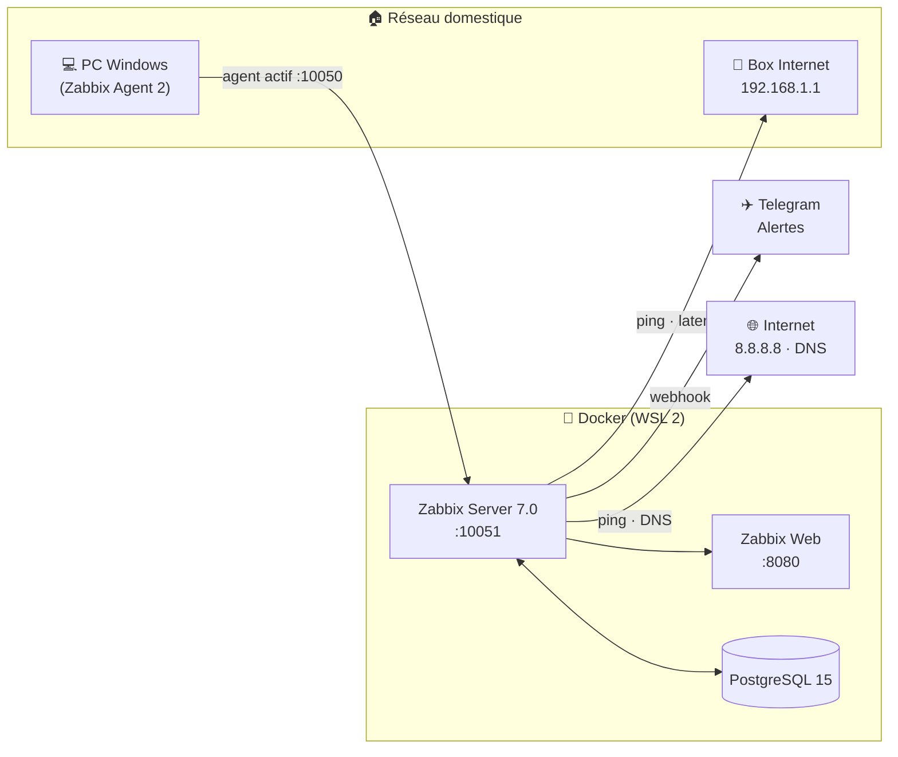

# 🏗️ Architecture — Mini-NOC

## Schéma général

## Composants

### 🖥️ Zabbix Server 7.0 (`zabbix-server`, port 10051)
Cœur du système. Il collecte les métriques (via l'agent et des vérifications simples),
évalue les seuils (triggers), déclenche les alertes et expose l'API utilisée par l'interface web.

### 🗄️ PostgreSQL 15 (`postgres`)
Base de données du serveur Zabbix : historique des métriques, configuration, événements.
Données persistées dans le volume Docker `pgdata`.

### 🌐 Zabbix Web (`zabbix-web`, port 8080)
Interface Nginx + PHP : dashboards, graphiques, gestion des hôtes et des alertes.
Accessible sur `http://localhost:8080` (login par défaut `Admin` / `zabbix` — à changer).

### 💻 Zabbix Agent 2 (sur le PC Windows)
Agent installé sur le poste supervisé. En mode **actif**, il pousse ses métriques
(CPU, RAM, disque, uptime) vers le serveur sur le port 10051.

### 📡 Box Internet & 🌐 Internet (vérifications simples)
Pas d'agent : le serveur Zabbix interroge directement.
- **Box** : `net.tcp.service[tcp,192.168.1.1,80]` — la box bloque le ping (ICMP) par
  défaut, on teste donc sa page d'administration web à la place.
- **Internet** : `icmpping[8.8.8.8]` pour la connectivité, `net.tcp.service[tcp,8.8.8.8,53]`
  pour le DNS (`net.dns` n'existe qu'en mode agent, pas en vérification simple).

> Note : sur ce poste, tout le trafic passe par un VPN (premier saut `10.2.0.1`) —
> la box est en mode furtif (aucune réponse ICMP/TCP depuis le LAN), d'où le choix
> du port 80.

### ✈️ Telegram (media type)
Webhook Zabbix : dès qu'un trigger passe en état *Problem*, un message est envoyé
au bot Telegram configuré.

## Flux de données

1. **Collecte** : l'agent pousse les métriques système → serveur ; le serveur
   interroge la box et Internet (ICMP/DNS).
2. **Stockage** : le serveur écrit l'historique dans PostgreSQL.
3. **Évaluation** : les triggers comparent les valeurs aux seuils à chaque collecte.
4. **Alerte** : si seuil dépassé → action → message Telegram.
5. **Visualisation** : l'interface web lit PostgreSQL et affiche dashboards/graphiques.

## Ports exposés sur l'hôte

| Service | Port hôte | Port conteneur | Usage |
|---|---|---|---|
| zabbix-web | 8080 | 8080 | Interface web |
| zabbix-server | 10051 | 10051 | Collecte agent (traps) |
| zabbix-agent (PC) | 10050 | — | Écoute agent (si mode passif) |
