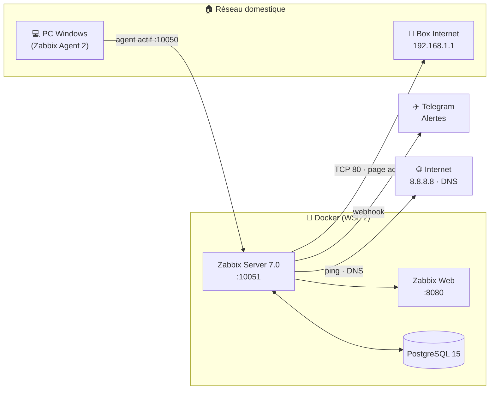

# 🏠📡 Mini-NOC — Centre de supervision réseau à la maison


> Un mini **NOC** (*Network Operations Center*) domestique : supervision du PC, de la box Internet et de la connexion avec **Zabbix**, alertes temps réel sur **Telegram** et tableau de bord style salle de contrôle.
>
> 📖 *English version: [README_EN.md](README_EN.md)*

## 🎯 Pourquoi ce projet ?

Projet vitrine pour viser des postes **NOC / Support N2-N3 / Administrateur systèmes & réseaux**.
Zabbix est le standard des centres de supervision (opérateurs télécoms, ESN, DSI).
Ce projet démontre : déploiement conteneurisé, supervision active et passive,
définition de seuils d'alerte, diagnostic réseau — le vocabulaire exact d'un entretien NOC.

## 🏗️ Architecture



📐 Détail complet : [docs/ARCHITECTURE.md](docs/ARCHITECTURE.md)

## 🧰 Stack

| Composant | Technologie | Rôle |
|---|---|---|
| Supervision | Zabbix Server 7.0 | Collecte, seuils, alertes |
| Base de données | PostgreSQL 15 | Stockage des métriques |
| Interface web | Zabbix Web (Nginx) | Dashboard — `http://localhost:8080` |
| Conteneurs | Docker Compose (WSL 2) | Déploiement reproductible |
| Alerting | Telegram (webhook) | Notification temps réel |
| Métriques | ICMP, DNS, Zabbix Agent 2 | Ping, latence, CPU/RAM/disque |

## ⚡ Démarrage rapide

```bash
# 1. Installer Docker Desktop (avec WSL 2) sur Windows
# 2. Lancer la stack :
docker compose up -d
# 3. Ouvrir http://localhost:8080 — login : Admin / zabbix
```

📘 Guide complet étape par étape : [docs/INSTALLATION.md](docs/INSTALLATION.md)

## ✅ Fonctionnalités

- 🖥️ **PC Windows** : CPU, RAM, disque, uptime via Zabbix Agent 2
- 📡 **Box Internet** : page d'administration (port 80) — le ping ICMP est bloqué par la box
- 🌐 **Connexion** : ping `8.8.8.8`, DNS via le port 53
- 🔔 **Alertes Telegram** dès qu'un seuil est dépassé (coupure, service injoignable)
- 📊 **Dashboard NOC** : disponibilité des hôtes, problèmes en cours, graphiques

## 🗺️ Roadmap

| Phase | Statut |
|---|---|
| 1. Stack Docker + documentation | ✅ Terminé |
| 2. Déploiement local | ⬜ À venir |
| 3. Supervision PC + box + Internet | ⬜ À venir |
| 4. Alertes Telegram | ⬜ À venir |
| 5. Dashboard NOC + captures | ⬜ À venir |
| 6. Publication GitHub + portfolio | ⬜ À venir |

🗺️ Détail : [ROADMAP.md](ROADMAP.md)

## 🛠️ Compétences démontrées

`Supervision (Zabbix)` · `ICMP / DNS` · `Docker Compose` · `Gestion d'alertes` ·
`Diagnostic réseau` · `Documentation technique`

## 📸 Captures d'écran


---
👤 **Ilyass Elkassili** — Technicien systèmes & réseaux (Meknès, Maroc) · en route vers NOC / N2-N3
