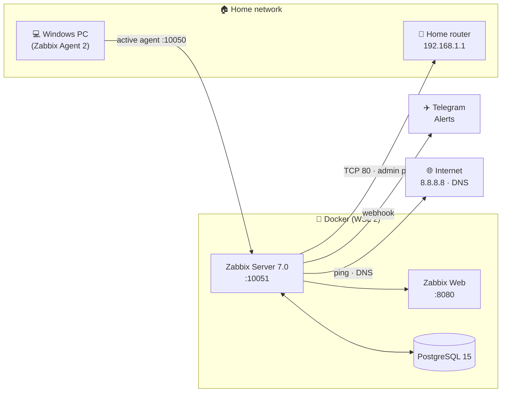
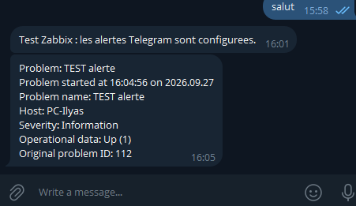

# 🏠📡 Mini-NOC — Home Network Operations Center


> A home-built mini **NOC** (*Network Operations Center*): monitoring a Windows PC, the home router and the Internet connection with **Zabbix**, real-time alerts on **Telegram**, and a control-room-style dashboard.
>
> 📖 *Version française : [README.md](README.md)*

## 🎯 Why this project?

Showcase project targeting **NOC / L2-L3 Support / Systems & Network Administrator** roles.
Zabbix is the standard monitoring platform in operations centers (telcos, MSPs, enterprise IT).
This project demonstrates: containerized deployment, active and passive monitoring,
alert threshold design, network diagnostics — the exact vocabulary of a NOC interview.

## 🏗️ Architecture



📐 Full details: [docs/ARCHITECTURE.md](docs/ARCHITECTURE.md)

## 🧰 Stack

| Component | Technology | Role |
|---|---|---|
| Monitoring | Zabbix Server 7.0 | Collection, thresholds, alerts |
| Database | PostgreSQL 15 | Metrics storage |
| Web UI | Zabbix Web (Nginx) | Dashboard — `http://localhost:8080` |
| Containers | Docker Compose (WSL 2) | Reproducible deployment |
| Alerting | Telegram (webhook) | Real-time notification |
| Metrics | ICMP, DNS, Zabbix Agent 2 | Ping, latency, CPU/RAM/disk |

## ⚡ Quick start

```bash
# 1. Install Docker Desktop (with WSL 2) on Windows
# 2. Start the stack:
docker compose up -d
# 3. Open http://localhost:8080 — login: Admin / zabbix
```

📘 Full step-by-step guide: [docs/INSTALLATION.md](docs/INSTALLATION.md)

## ✅ Features

- 🖥️ **Windows PC**: CPU, RAM, disk, uptime via Zabbix Agent 2
- 📡 **Home router**: admin page (port 80) — ICMP ping is blocked by the router
- 🌐 **Internet**: ping `8.8.8.8`, DNS over port 53
- 🔔 **Telegram alerts** whenever a threshold is breached (outage, unreachable service)
- 📊 **NOC dashboard**: host availability, ongoing problems, graphs

## 🗺️ Roadmap

| Phase | Status |
|---|---|
| 1. Docker stack + documentation | ✅ Done |
| 2. Local deployment | ⬜ Upcoming |
| 3. PC + router + Internet monitoring | ⬜ Upcoming |
| 4. Telegram alerts | ⬜ Upcoming |
| 5. NOC dashboard + screenshots | ⬜ Upcoming |
| 6. GitHub publish + portfolio | ⬜ Upcoming |

🗺️ Details: [ROADMAP.md](ROADMAP.md)

## 🛠️ Skills demonstrated

`Monitoring (Zabbix)` · `ICMP / DNS` · `Docker Compose` · `Alert management` ·
`Network diagnostics` · `Technical documentation`

## 📸 Screenshots




---
👤 **Ilyass Elkassili** — Systems & Network Technician (Meknès, Morocco) · working towards NOC / L2-L3 roles
